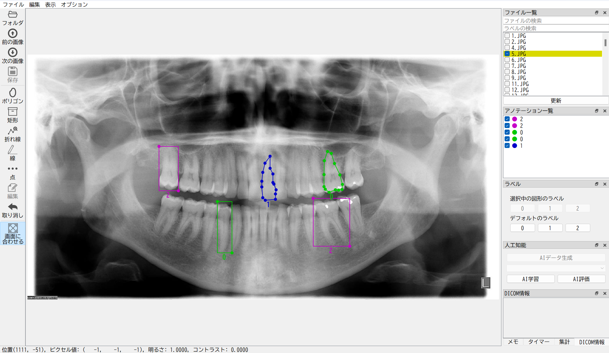

<div align="center">
  <a href="./README.md">English</a> |
  <a href="./README-ja.md">日本語</a>
</div>

#

<h1 align="center">
  <br>
  Aidia
</h1>

<h4 align="center">
  AI Development and Image Annotation
</h4>

<div align="center">
  <a href="https://www.python.org/">
  </a>
  <a href="https://www.tensorflow.org">
  </a>
  <a href="https://www.qt.io">
  </a>
  <a href="https://developer.nvidia.com/cuda-toolkit">
  <br>
  </a>
  <a href="https://developer.nvidia.com/cudnn">
  </a>
</div>

<br>

<div align="center">
  
</div>


## 概要
AidiaはAI開発機能を統合した医用画像アノテーションツールです。
[Labelme](https://github.com/wkentaro/labelme)にインスパイアされており，PythonとQtを用いてプログラムを構築しています。
WindowsでAI開発機能を除いた簡易的なAidiaを利用する場合は，Windowsバイナリを[GitHub Releases](https://github.com/wt501/Aidia/releases)で提供しています。


## 機能
- ポリゴン，矩形，折れ線，線，点のアノテーション作成。
- カスタマイズ可能なボタンによる簡単なラベリング。
- 拡張子を持たないDICOMファイルを含むDICOMフォーマットのサポート。
- DICOMビューアののようなマウスドラッグによる明るさ・コントラスト調整。


## 必要環境
- Inno Setup
- Pyinstaller 5.13.2 (self compiled)
- MinGW (for C compiler)

## 初回インストール
1. [GitHub Releases](https://github.com/wt501/Aidia/releases)のAssets -> Source code (zip)をダウンロード・解凍します。

1. [Anaconda](https://www.anaconda.com/download)をインストールします。

1. ターミナル（端末）を開きます。
Windowsの場合は「コマンドプロンプト」ではなく，「Anaconda Prompt」を使用します。

1. 以下のコマンドを実行します。
x.x.x.xはバージョン番号です。
```bash
cd Downloads/Aidia-x.x.x.x/Aidia-x.x.x.x
conda create --n aidia python=3.9
conda activate aidia
python install.py
```

## 実行
```bash
conda activate aidia
aidia
```

## アップデート
1. [GitHub Releases](https://github.com/wt501/Aidia/releases)のAssets -> Source code (zip)をダウンロード・解凍します。

1. ターミナル（端末）を開きます。
Windowsの場合は「コマンドプロンプト」ではなく，「Anaconda Prompt」を使用します。

1. 以下のコマンドを実行します。
x.x.x.xはバージョン番号です。
```bash
cd Downloads/Aidia-x.x.x.x/Aidia-x.x.x.x
conda activate aidia
python install.py
```


## GPUの設定
TensorFlowのGPUサポートには以下のライブラリが必要です。
- [CUDA Toolkit 11.2](https://developer.nvidia.com/cuda-11.2.2-download-archive)
- [cuDNN 8.1.0](https://developer.nvidia.com/rdp/cudnn-archive)

Anacondaを使用してCUDA ToolkitとcuDNNをインストールする場合は以下のコマンドを実行します。
```bash
conda activate aidia
conda install -c conda-forge cudatoolkit=11.2.2 cudnn=8.1.0
```


## バイナリのビルド
バイナリのビルドはAI関係機能を無効にする必要があるため、`aidia/__init__.py`の`ADD_AI`を`False`に変更します。
```python
ADD_AI = False
```
その後、以下のコマンドを実行します。
```bash
# ビルド用環境の作成
conda create -n aidia_exe python=3.9
conda activate aidia_exe
pip install -r requirement_bin.txt

# ビルドの実行
python build.py
```

## Pyinstallerのビルド
bootloaderが原因でアプリケーションがウイルスに引っかかる可能性がある。
その対策としてpyinstallerをソースコードからビルドする必要がある。

1. download from https://github.com/pyinstaller/pyinstaller/releases/tag/v5.13.2
1. cd pyinstaller/bootloader
1. python ./waf distclean all
1. cd pyinstaller
1. pip install .


## 謝辞
このレポジトリは[wkentaro/labelme](https://github.com/wkentaro/labelme)のフォークであり,GUIの構築に[ICOOON MONO](https://icooon-mono.com/)を使用しました。

## 参考文献

### YOLOの実装
[hunglc007/tensorflow-yolov4-tflite](https://github.com/hunglc007/tensorflow-yolov4-tflite)