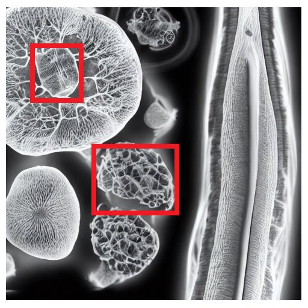
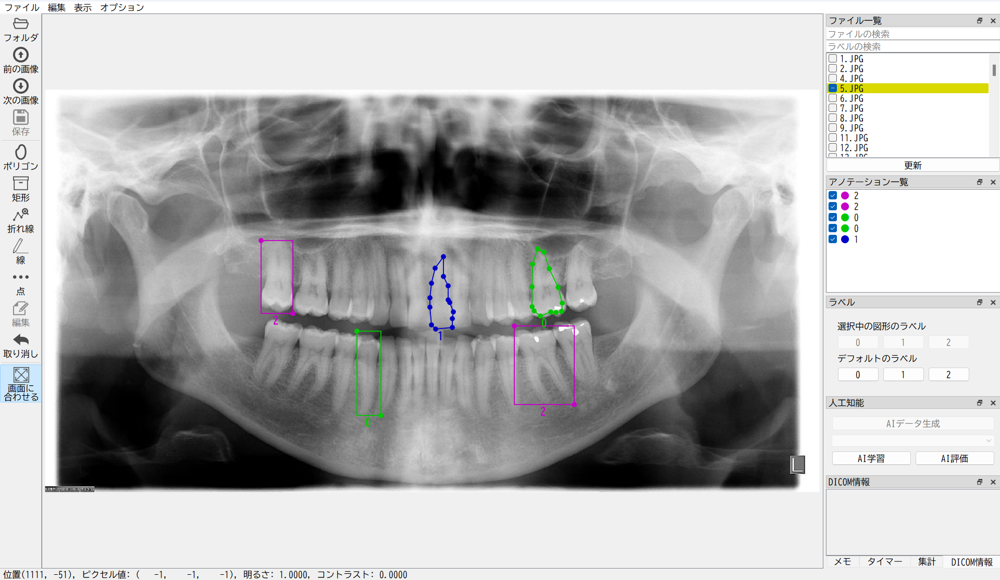

<h1 align="center">
  <br>
  Aidia
</h1>

<h4 align="center">
  AI Development and Image Annotation
</h4>

<div align="center">
  
</div>


## Description
Aidia is a medical image annotation tool with AI development utilities.
Pre-built packages (Windows) of Aidia and documents are available at [Torii Lab](https://kottonhome.sakura.ne.jp/index.html) (Japanese only).


## Features
- Image annotation for polygon, rectangle, polyline, line and point.
- Simply labeling by customized GUI buttons.
- DICOM format support including DICOM files which have no extention (.dcm).
- Adjustment of brightness and contrast by mouse dragging like a DICOM viewer.


## Installation
You need install [Anaconda](https://www.anaconda.com/download), then run below:
```bash
conda create --n aidia python=3.9
conda activate aidia
python install.py
```


## Launch App
```bash
conda activate aidia  # if you did not activate the environment
aidia
```

## Development

```bash
conda activate aidia
pip install -r requirements.txt  # if not installed
python -m aidia
```

## Translation

```bash
pylupdate5 translate.pro
linguist
```

 [Qt Linguist Binary](https://github.com/lelegard/qtlinguist-installers/releases)

## GPU Support

TensorFlow GPU support requires below:

- [CUDA Toolkit 11.2](https://developer.nvidia.com/cuda-11.2.2-download-archive)
- [cudDNN 8.1.0](https://developer.nvidia.com/rdp/cudnn-archive)


## Acknowledgement
This project is inspired from [wkentaro/labelme](https://github.com/wkentaro/labelme).


## References
[hunglc007/tensorflow-yolov4-tflite](https://github.com/hunglc007/tensorflow-yolov4-tflite)